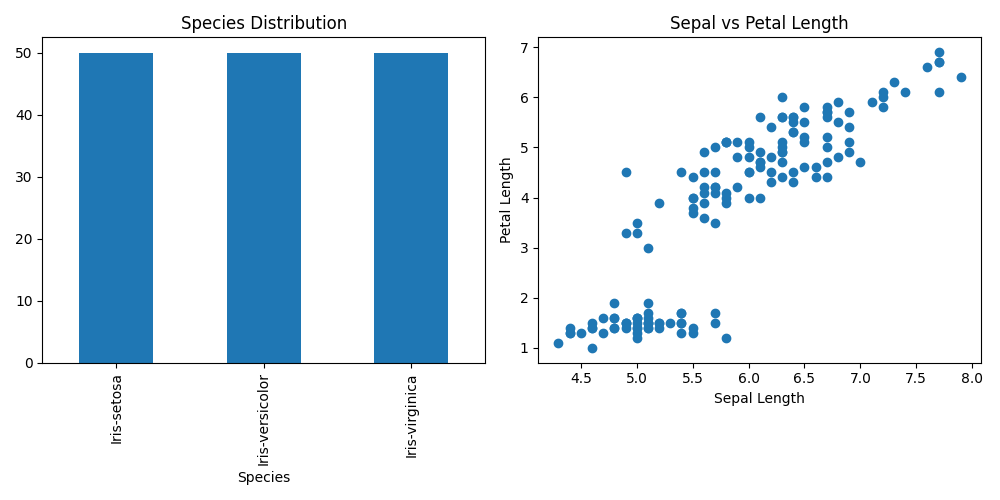

# Iris Flower Classification

## Objective

The objective of this project is to classify iris flowers into different species using Machine Learning.

## Dataset

Iris Flower Dataset

## Technologies Used

* Python
* Pandas
* NumPy
* Matplotlib
* Scikit-Learn

## Algorithm Used

* K-Nearest Neighbors (KNN)

## Features

* Sepal Length
* Sepal Width
* Petal Length
* Petal Width

## Project Workflow

1. Data Loading
2. Data Cleaning
3. Exploratory Data Analysis (EDA)
4. Data Visualization
5. Feature Selection
6. Model Training
7. Prediction
8. Accuracy Evaluation

## Output

The model predicts the following iris flower species:

* Iris-setosa
* Iris-versicolor
* Iris-virginica

## Output Graphs

## Accuracy

Model Accuracy: 100%

## Conclusion

The KNN model successfully classified iris flowers into Setosa, Versicolor, and Virginica species with 100% accuracy.

## Author

Harshraj Punvar
